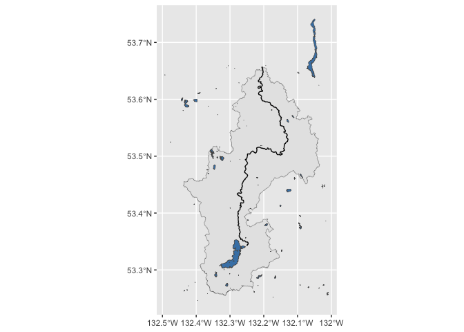

<!-- README.md is generated from README.Rmd. Please edit that file -->

# fwapgr 

<!-- badges: start -->

[](https://lifecycle.r-lib.org/articles/stages.html#experimental)
[](https://github.com/poissonconsulting/fwapgr/actions)
[](https://codecov.io/gh/poissonconsulting/fwapgr?branch=master)
[](https://opensource.org/licenses/MIT)
<!-- badges: end -->

`fwapgr` is an R client for the [fwapg pg-featureserv web
API](https://www.hillcrestgeo.ca/fwapg/index.html) used to get data from
the [B.C. Freshwater
Atlas](https://www2.gov.bc.ca/gov/content/data/geographic-data-services/topographic-data/freshwater).
Data are returned as [simple features](https://github.com/r-spatial/sf).
Functions and arguments exactly match those available in the API.

If you are looking for a user-friendly R 📦 for retrieving data from the
[B.C. Freshwater
Atlas](https://www2.gov.bc.ca/gov/content/data/geographic-data-services/topographic-data/freshwater)
please see [fwatlasbc](https://github.com/poissonconsulting/fwatlasbc)
which wraps `fwapgr`.

## Introduction

`fwapgr` allows you to perform three types of operation.

Get information about
[collections](https://www.hillcrestgeo.ca/fwapg/collections.html) or a
collection’s properties:

-   `fwa_collections()`  
-   `fwa_meta_properties()`

Query features from
[collections](https://www.hillcrestgeo.ca/fwapg/collections.html):

-   `fwa_collection()`

Execute spatial
[functions](https://www.hillcrestgeo.ca/fwapg/functions.html):

-   `fwa_index_point()`  
-   `fwa_locate_along()`
-   `fwa_locate_along_interval()`
-   `fwa_watershed_at_measure()`  
-   `fwa_watershed_hex()`  
-   `fwa_watershed_stream()`

## Installation

To install the developmental version from
[GitHub](https://github.com/poissonconsulting/fwapgr)

``` r
# install.packages("devtools")
devtools::install_github("poissonconsulting/fwapgr")
```

## Demonstration

Get Yakoun River stream from
‘whse\_basemapping.fwa\_stream\_networks\_sp’ collection:

``` r
yakoun <- fwapgr::fwa_collection("whse_basemapping.fwa_stream_networks_sp", filter = list(gnis_name = "Yakoun River"))
yakoun[c("blue_line_key", "gnis_name", "length_metre")]
#> Simple feature collection with 100 features and 3 fields
#> Geometry type: LINESTRING
#> Dimension:     XYZ
#> Bounding box:  xmin: -132.2789 ymin: 53.34324 xmax: -132.1304 ymax: 53.65705
#> z_range:       zmin: 1 zmax: 99
#> Geodetic CRS:  WGS 84
#> # A data frame: 100 × 4
#>    blue_line_key gnis_name    length_metre                              geometry
#>            <int> <chr>               <dbl>                      <LINESTRING [°]>
#>  1     360881586 Yakoun River        938.  Z (-132.2671 53.43742 63.25, -132.26…
#>  2     360881586 Yakoun River         30.9 Z (-132.2761 53.43518 65.5, -132.276…
#>  3     360881586 Yakoun River         92.8 Z (-132.2754 53.38684 91, -132.2754 …
#>  4     360881586 Yakoun River        436.  Z (-132.254 53.47959 47.516, -132.25…
#>  5     360881586 Yakoun River        224.  Z (-132.2703 53.40627 86.245, -132.2…
#>  6     360881586 Yakoun River         51.8 Z (-132.2643 53.45082 54, -132.2643 …
#>  7     360881586 Yakoun River         56.4 Z (-132.2524 53.48409 45.503, -132.2…
#>  8     360881586 Yakoun River        933.  Z (-132.1531 53.5715 14.439, -132.15…
#>  9     360881586 Yakoun River        295.  Z (-132.2401 53.50416 41.928, -132.2…
#> 10     360881586 Yakoun River       1195.  Z (-132.2539 53.46113 53, -132.2541 …
#> # … with 90 more rows
```

Get Yakoun River watershed starting 10km upstream:

``` r
wshed <- fwapgr::fwa_watershed_at_measure(unique(yakoun$blue_line_key), downstream_route_measure = 10000)
```

Use `transform` argument to simplify polygons. See valid transformation
functions
[here](https://github.com/CrunchyData/pg_featureserv/blob/master/config/pg_featureserv.toml.example#L29)

``` r
wshed_simple <- fwapgr::fwa_watershed_at_measure(unique(yakoun$blue_line_key), downstream_route_measure = 10000, transform = c("ST_Simplify", 2000))
```

``` r
ggplot2::ggplot() +
  ggplot2::geom_sf(data = wshed_simple, lwd = 0.15, fill = "red", alpha = 0.1) +
  ggplot2::geom_sf(data = wshed, lwd = 0.15, fill = "steelblue", alpha = 0.5) +
  ggplot2::geom_sf(data = yakoun, lwd = 0.15)
```



## Credit and Inspiration

`fwapgr` is built on the [fwapg pg-featureserv web
API](https://www.hillcrestgeo.ca/fwapg/index.html) hosted and created by
[Simon Norris](https://github.com/smnorris/fwapg) at [Hillcrest
Geographics](https://hillcrestgeo.ca/main/). It supersedes the archived
[`fwabc`](https://github.com/poissonconsulting/fwabc) 📦 which retrieved
data [via
WFS](https://openmaps.gov.bc.ca/geo/pub/wfs?service=WFS&version=2.0.0&request=GetFeature&typeName=WHSE_BASEMAPPING.FWA_LAKES_POLY&outputFormat=json&SRSNAME=epsg%3A3005&CQL_FILTER=GNIS_NAME_1=%27Quamichan%20Lake%27)
using the [bcdata](https://github.com/bcgov/bcdata) 📦.

Many thanks to [Simon Norris](https://github.com/smnorris/fwapg) for his
work on [fwapg](https://github.com/smnorris/fwapg) PostgreSQL database
and [the pg-featureserv web
API](https://www.hillcrestgeo.ca/fwapg/index.html).

## Contribution

Please report any
[issues](https://github.com/poissonconsulting/fwapgr/issues).

[Pull requests](https://github.com/poissonconsulting/fwapgr/pulls) are
always welcome.

## Code of Conduct

Please note that the fwapgr project is released with a [Contributor Code
of
Conduct](https://contributor-covenant.org/version/2/0/CODE_OF_CONDUCT.html).
By contributing to this project, you agree to abide by its terms.
